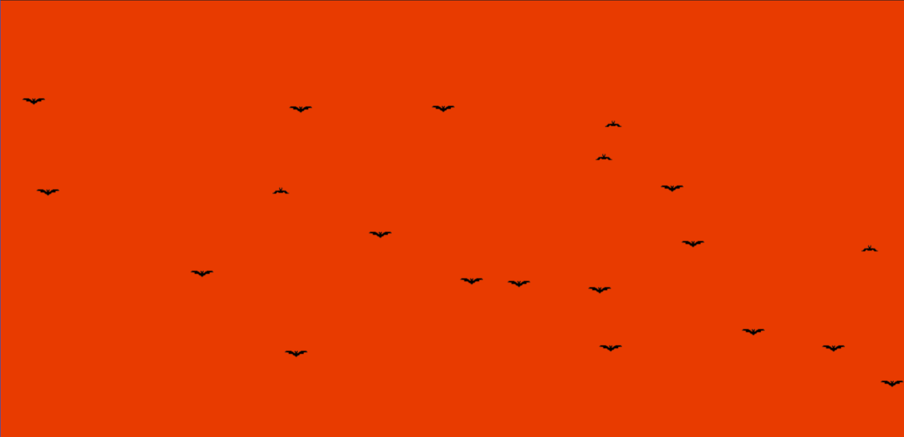

# tsParticles Preset Halloween Bats

[](https://www.jsdelivr.com/package/npm/tsparticles-preset-halloween-bats) [](https://www.npmjs.com/package/tsparticles-preset-halloween-bats) [](https://www.npmjs.com/package/tsparticles-preset-halloween-bats)

## Sample



**This is my presset for [tsparticles](https://www.npmjs.com/package/tsparticles)**

**You can find more details at [tsparticles's document](https://particles.js.org/docs/) and its [github repository](https://github.com/matteobruni/tsparticles)**

## How to use it

### React.js / Preact / Inferno

_The syntax for `React.js`, `Preact` and `Inferno` is the same_.

This sample uses the class component syntax, but you can use hooks as well (if the library supports it).

```javascript
import Particles from "react-tsparticles";
import { Main } from "tsparticles";
import { loadFlyingBat } from "tsparticles-preset-halloween-bats";

export class ParticlesContainer extends React.PureComponent<IProps> {
  // this customizes the component tsParticles installation
  customInit(main: Main) {
    // this adds the preset to tsParticles, you can safely use the
    loadFlyingBat(main);
  }

  render() {
    const options = {
      preset: "FlyingBat",
    };

    return <Particles options={options} init={this.customInit} />;
  }
}
```

If you preffer using function :

```javascript
import Particles from "react-tsparticles";
import { Main } from "tsparticles";

import { loadFlyingBat } from "tsparticles-preset-halloween-bats";
function particlesInit(Main) {
  loadFlyingBat(Main);
}
export default function Bat() {
  return (
    <Particles
      options={{
        preset: "FlyingBat",
      }}
      init={particlesInit}
    />
  );
}
```

#### Customization

**Important ⚠️**
You can override all the options defining the properties like in any standard `tsParticles` installation.

```javascript
const options = {
  background: {
    color: "#e83b00",
  },
  preset: "FlyingBat",
};
```

## **_Options_**

You can find all options
available [here](https://particles.js.org/docs/interfaces/Options_Interfaces_IOptions.IOptions.html) 📖
